# Chapter 12 An Introduction to Istio
## Technical requirements
This chapter has the following technical requirements:

* A Docker host installed using the steps from Chapter 1, Docker and Container Essentials, with a minimum of 8GB of RAM
* A KinD cluster configured using the initial scripts from Chapter 2, Deploying Kubernetes Using KinD
* Installation scripts from this book's GitHub repository
> **⚠ ATTENTION:**
> To use Istio to expose workloads, we will remove NGINX from the KinD cluster, which will allow Istio to utilize ports ``80`` and ``443`` on the host.
## Installing Istio
There are multiple methods to deploy Istio. The most common method today is to use either ``istioctl`` or the Istio operator, but there are additional options depending on your organization. You may elect to use one of the alternative installation methods of creating manifests via istoctl or the Helm chart (which as of the time of writing is considered alpha).

A brief list of advantages and disadvantages for each method is detailed in *Table 12.1: Istio deployment methods*.

|  |  |  |
|---|---|---|
| **Deployment method** | **Advantages** | **Disadvantages** |
| istioctl | 1. Configuration validation and health checks<br />  2. Does not require any privileged pods, increasing cluster security<br /> 3. Multiple configuration options | 1. Each Istio version requires a new binary | 
| Istio Operator | 1. Configuration validation and health<br /> 2. Does not require multiple binaries for each Istio version<br /> 3. Multiple configuration options | 1. Requires a privileged pod running in the cluster |
| Manifests (via istioctl) | 1. Generates manifests that can be customized before deploying using kubectl<br /> 2. Multiple configuration options | 1. Not all checks are performed, which could lead to deployment errors<br /> 2. Error checks and reporting are limited when compared to using istioctl or the Istio operator | 
| Helm | 1. Helm and charts are well known to most Kubernetes users<br /> 2. Leverages Helm standards, which allow for easy management of deployments | 1. Offers the least validation checks of all deployment options<br /> 2. Most tasks will require additional work and complexity versus the other deployment models |


Table 12.1: Istio deployment methods

For the chapter, we will focus on using the istioctl binary for installation, and in the next section, we will deploy Istio using istioctl.

### Downloading Istio
The first thing that we need is to define the version of Istio we want to deploy. We can do this by setting an environment variable, and in our example, we want to deploy Istio 1.12.2:

```bash 
export ISTIO_VERSION=1.12.2
```

Next, we will download the Istio installer using CURL:

```bash 
curl -L https://istio.io/downloadIstio | sh -
```

This will download the installation script and execute it using the ``ISTIO_VERSION`` that we defined before executing the ``curl`` command. After executing you will have an ``istio-1.12.2`` directory in your current working directory.

Finally, since we will be using executables from the ``istio-1.12.2`` directory, you should add it to your ``path`` statement. To make this easier, you should be in the ``chapter12`` directory from the book repository before setting the ``path`` variable.

```bash 
export PATH="$PATH:$PWD/istio-$ISTIO_VERSION/bin"
```
### Installing Istio using a Profile

To make deploying Istio easier, the team has included a number of pre-defined profiles. Each profile defines which components are deployed and the default configuration. There are six profiles included, but only four profiles are used for most deployments.

| **Profile** | **Installed Components**                                  |
|---------|-------------------------------------------------------|
| Default | istio-ingressgateway and istiod                       |
| Demo    | istio-egressgateway, istio-ingressgateway, and istiod |
| Minimal | istiod                                                |
| Preview | istio-ingressgateway and istiod                       |

Table 12.2: Istio profiles

If none of the included profiles fit your deployment requirements, you can create a customized deployment. This is beyond the scope of this chapter since we will be using the included demo profile – however, you can read more about customizing the configuration on Istio's site, https://istio.io/latest/docs/setup/additional-setup/customize-installation/.

To deploy Istio using the demo profile using istioctl, we simply need to execute a single command:

```bash 
istioctl manifest install --set profile=demo
```
The installer will ask you to verify that you want to deploy Istio using the default profile, which will deploy all of the Istio components:

```bash
This will install the Istio 1.12.2 demo profile with ["Istio core" "Istiod" "Ingress gateways" "Egress gateways"] components into the cluster. Proceed? (y/N)
```
Press the ``y`` key to say yes to proceed with the deployment. If you want to bypass the confirmation, you can add an option to the istioctl command line, ``--skip-confirmation``, which tells istioctl to bypass the confirmation.

If everything went well, you should see a confirmation that each component was installed, and a completion message that thanks you for installing Istio.

```bash
✔ Istio core installed
✔ Istiod installed
✔ Egress gateways installed
✔ Ingress gateways installed
✔ Installation complete
Thank you for installing Istio 1.12.2.  Please take a few minutes to tell us about your install/upgrade experience!
```

The istioctl executable can be used to verify the installation. To verify the installation, you require a manifest and since we used istioctl to deploy Istio directly, we do not have a manifest, so we need to create one to check our installation.

```bash 
istioctl manifest generate --set profile=demo > istio-kind.yaml
```

Then run the ``istioctl verify-install`` command.

```bash 
istioctl verify-install -f istio-kind.yaml
```
This will verify each component, and once verified, it will provide a summary similar to the output below:
```bash
Checked 13 custom resource definitions
Checked 3 Istio Deployments
✔ Istio is installed and verified successfully
```
Now that we have verified the installation, let's look at what istioctl created:

* A new namespace called istio-system
* Three deployments were created, and a corresponding service for each:
    * istio-ingressgateway
    * istio-egressgateway
    * istiod
* CustomResourceDefinitions (CRDs) to provide the Istio resources including:
    * authorizationpolicies.security.istio.io
    * gateways.networking.istio.io
    * virtualservices.networking.istio.io
    * destinationrules.networking.istio.io
    * peerauthentications.security.istio.io
    * requestauthentications.security.istio.io
    * serviceentries.networking.istio.io
    * sidecars.networking.istio.io
    * envoyfilters.networking.istio.io

Don't worry about all of the CRs at this point. We will go into the details of each resource throughout the chapter, and in the next chapter, we will go into the details of deploying an application into the mesh, which will utilize many of the deployed CRs.

With Istio deployed, our next step is to expose it to our network so we can access the applications we'll build. Since we're running on KinD this can be tricky. Docker is forwarding all traffic from port ***80*** (HTTP) and ***443*** (HTTPS) on our KinD server to the worker node. The worker node is in turn running the NGINX Ingress controller on ports ***443*** and ***80*** to receive that traffic. 

In a real-world scenario, we'd use an external load balancer, like MetalLB, to expose the individual services via a ***LoadBalancer***. 

For our labs though, we're going to instead focus on simplicity. 
We created a script in the  ``chapter12``  directory called  ``expose_istio.sh``  that will do two things. 
```bash 
cd chapter12
./expose_istio.sh
```

First, it will delete the ***ingress-nginx*** namespace, removing NGINX and freeing up ports 80 and 443 on the Docker host. 

Second, it will patch the ***istio-ingressgateway*** Deployment in the ***istio-system*** namespace so that it runs on ports ***80*** and ***443*** on the worker node.

##  Deploying add-on components to provide observability
By now, you know how to deploy Istio and understand some of the most used objects, but you haven't seen one of the most useful features yet – observability. At the beginning of the chapter, we mentioned that observability was one of our favorite features provided by Istio, and in this chapter, we will explain how to deploy a popular Istio add-on called Kiali.

### Installing Prometheus
Before we install Kiali, we need to deploy an open-source monitoring and alert component called Prometheus that was developed by SoundCloud to store our mesh metrics. Prometheus was developed in 2012 and in 2016 it was added to the **Cloud Native Computing Foundation (CNCF)**, becoming only the second project in the CNCF behind Kubernetes.

People who are newer to Prometheus and Kubernetes often misunderstand the features provided by Prometheus. Prometheus does not provide logging for your containers or infrastructure, that's where products like Elasticsearch and Kibana come in. Instead, Prometheus keeps track of your cluster metrics, which are used for performance tracking. Metrics include information like throughput, CPU usage, latency, and more. You can read more about Prometheus at their site, https://prometheus.io/.

To deploy Prometheus, we have included a custom Prometheus installation in the chapter12 directory. You can deploy it using kubectl apply.

```bash
kubectl apply -f ./chapter12/prometheus-deployment.yaml
```

Many Prometheus example deployments do not maintain state, so for our deployment we have added persistency, leveraging the provisioner built into KinD, using a persistent volume claim named prom-pvc.

### Installing Jaeger
The next component we need to deploy is Jaegar, which is an open-source offering that provides tracing between services in Istio. Tracing may be a new term to some readers and, at a high level, traces are a representation of the execution path to a service. These allow us to view the actual path of the communication between services, providing an easy-to-understand view that provides metrics about performance and latency, allowing you to resolve issues quicker.

To deploy Jaeger, we have included a manifest in the chapter12 directory called jaeger-deployment.yaml. You can deploy it using kubectl apply.

```bash
kubectl apply -f ./chapter12/jaeger-deployment.yaml
```
Similar to the Prometheus installation, most deployments you find on the internet do not maintain persistency. We have added a persistent volume to our deployment called jaeger-pvc that is allocated using the KinD auto provisioner.

With Prometheus and Jaeger deployed, we can move on to the next section, which will cover the main topic for observability, Kiali.

### Installing Kiali
Kiali provides a powerful management console for our service mesh. It provides graphical views of our services, pods, traffic security, and more. Since it's a very useful tool for both developers and operators, the remainder of this chapter will focus on deploying and using Kiali.

There are a few options to deploy Kiali, but we will use the most common installation method, using the Helm chart.

```bash
helm install --namespace istio-system --set auth.strategy="anonymous" --repo https://kiali.org/helm-charts kiali-server kiali-server  
```

This will only deploy Kiali itself, it does not expose it for external access. We have created an Ingress manifest that will create an Ingress rule using the nip.io format we have used throughout the book. The manifest is located in the chapter12/kiali directory, called create-kiali-istio-objs.sh. Change your directory to chapter12/kiali to execute the script, which will create the VirtualService and Gateway objects for Kiali, using the name kiali.w.x.y.z.nip.io.

Once the Ingress has been created, the script will display the URL to access the Kiali dashboard. For this example, the Docker host has the IP address 10.2.1.165.

```bash
export hostip=$(hostname  -I | cut -f1 -d' ' | sed 's/[.]/-/g')
curl -v http://kiali.$hostip.nip.io/  
```
The Kiali ingress rule has been created. You can open the UI using http://kiali.10.2.1.165.nip.io/.

This deploys an anonymous access dashboard, however, Kiali can accept other authentication mechanisms to secure the dashboard. In the next chapter, we will modify the Kiali deployment to accept JWTs, using OpenUnison as the provider.

## Deploying an application into the service mesh
We could define the components and objects of Istio all day, but if you are like us, examples and use-cases are often more beneficial to understanding advanced concepts like the features provided by Istio. In this section, we will explain many of the custom resources in detail, providing examples that you can deploy in your KinD cluster.

### Deploying your first application into the mesh
Finally! We have Istio and the add-on components installed and we can move on to installing a real application in the service mesh to verify everything is working.

For this section, we will deploy an example application from Google called the Boutique app. In the next chapter, we will deploy a different application and explain all of the details and communication between the services, but the Boutique app is a great application to test out the mesh before we get into that level of information.

To deploy Google's Boutique app, execute the following steps:

1. Create a new namespace called ``demo`` and enable Istio by labeling the namespace
```bash
kubectl create ns demo
kubectl label ns demo istio-injection=enabled
```
2. Change your working directory to the ``chapter12/example-app`` directory
3. Deploy the Istio components for the Boutique app using the ``istio-manifest.yaml`` in the ``example-app`` directory
```bash
kubectl create -f ./istio-manifests.yaml -n demo
```
4. Next, we will deploy the Boutique application and required services
kubectl create -f ./kubernetes-manifests.yaml -n demo
5. Finally, to create the Gateway and VirtualService that will be used to access the Boutique application, execute the ``create-gw-vs.sh`` script
```bash
./create-gw-vs.sh
```
Once you execute each step, you will have a working demo application in the demo namespace. We will use this application to demonstrate the observability features of Istio and Kiali.

### Using Kiali to observe mesh workloads
Kiali provides observability in your service mesh. It provides a number of advantages to you and your developers, including a visual map of the traffic flow between objects, verifying mTLS between the services, logs, and detailed metrics.

### The Kiali overview screen
If you navigate to the homepage of Kiali, by using the URL provided when you executed the ``create-ingress`` script, this will open the Kiali overview page where you will see a list of namespaces in the cluster.

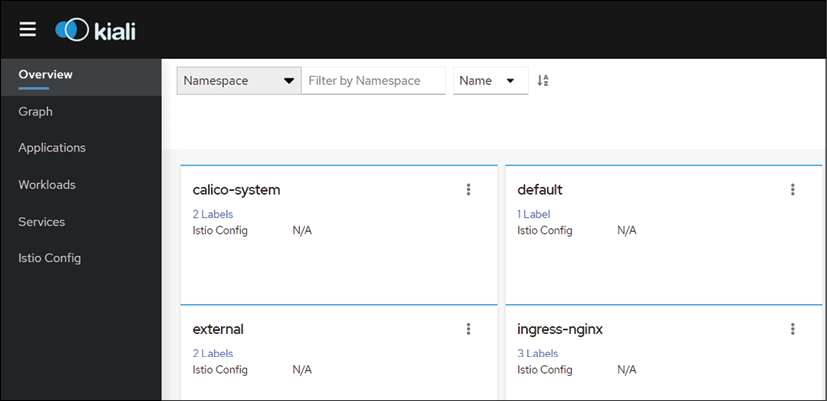  
Figure 12.3: The Kiali homepage

Kiali will show all namespaces in the cluster, even if they do not have Istio enabled. In our current deployment, it will show all namespaces, regardless of any RBAC that has been implemented since its running without any authentication. As mentioned in the *Installing Kiali* section, we will secure Kiali with JWTs in the next chapter.

### Using the Graph view
The first part of the dashboard that we will visit is the Graph view, which provides a graphical view of our application. Initially, it may look like a simple static graphical representation of the objects that make up the workload, but this is simply the default view when you open the Graph view; it isn't limited to a simple static view, as you will see in this section.

Since we deployed the example application into the ``demo`` namespace, click the three dots in the ``demo`` namespace tile and then select **Graph**:
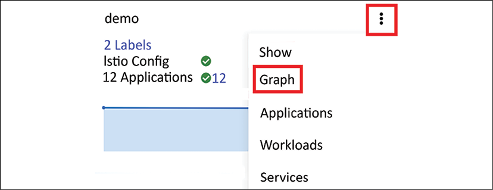  
Figure 12.4: Using Kiali to show a graph of a namespace

This will take you to a new dashboard view that shows the demo application objects:

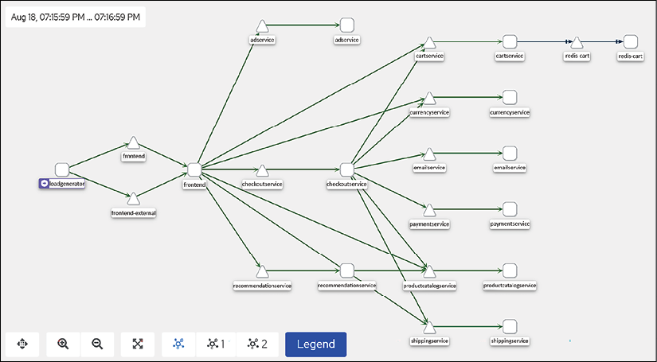  
Figure 12.5: Kiali graph example

There are a lot of objects in the graph, and if you are new to Kiali, you may be wondering what each of the icons represents. Kiali provides a legend to help you identify what role each icon plays.

If you click on the graph, you will see the legend – an abbreviated legend list is shown below:

  
Figure 12.6: Kiali graph legend example

By default, this view only shows the paths between the application objects in a static view. However, you are not limited only to the static view – this is where Kiali starts to shine. We can actually enable a live traffic view, enabling us to watch the traffic flow for all requests.

To enable this option, click the Display option that is just above the Graph view, and in the list of options, enable traffic animation by checking the box, as shown in Figure 12.7: Enabling traffic animation.

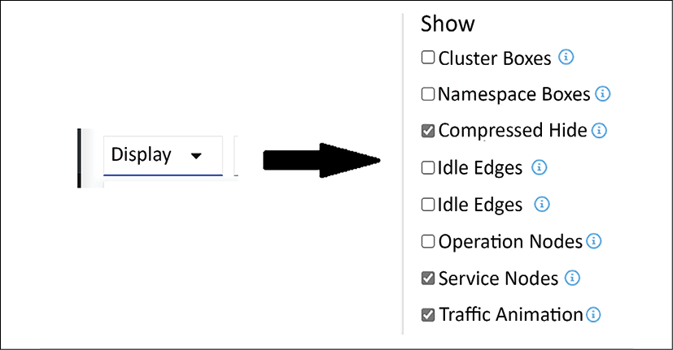  
Figure 12.7: Enabling traffic animation

It's difficult to display in a static image, but once you have enabled the traffic animation option, you will see the flow of all requests in real time.

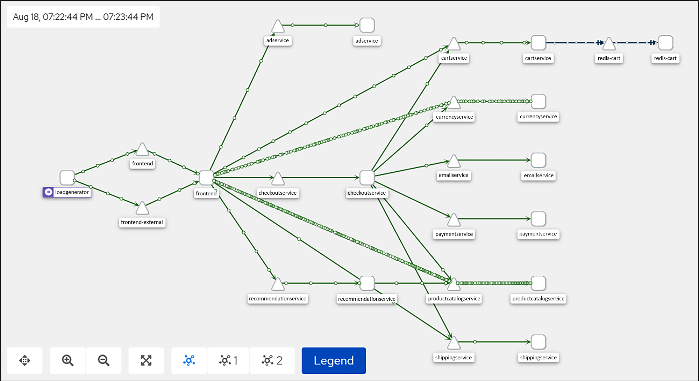  
Figure 12.8: Kiali traffic flow example

You are not limited to only traffic flow animations; you can use the **Display** option to enable a number of other options in the **Graph** view, including items like response time, throughput, traffic rate, and security.

In *Figure 12.9: Kiali graph display options*, we have enabled throughput, traffic distribution, traffic rate, and security:

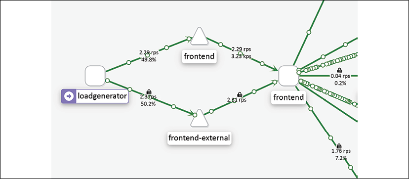  
Figure 12.9: Kiali graph display options

As you can see in the image, the lines between objects now include additional information, including:

* A lock, which confirms that the communication is encrypted via the sidecar and mTLS
* A percentage, which shows the traffic distribution
* RPS, which is the requests per second

As you can see, the Kiali graph view is a powerful tool for observing the end-to-end communication for your workload. This is just one of the additional benefits of using a service mesh. The observability that a mesh provides is an incredibly valuable tool for finding issues that would have been very difficult to uncover in the past.

We are not limited to only the Graph view; we also have three additional views that offer additional insight into the application. On the left-hand side of the Kiali dashboard, you will see the other three views, Applications, Workloads, and Services. You will also notice that there is one other option, Istio Config, which allows you to view the objects in the namespace that control the Istio features for the namespace.

### Using the Application view
The Application view shows you the details for the workloads that have the same labeling, allowing you to break down the view into smaller sections.

Using the Boutique application view that we have opened in Kiali, click on the **Applications** link in the left-hand options. This will take you to the overview page for the applications broken down by labels.

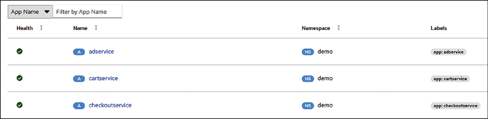 
Figure 12.10: Kiali application view

Each of the applications can provide additional information by clicking the name of the service. If we were to click the **adservice** application, Kiali would open a page providing an overview of what the adservice application interacts with. For each application, you can also look at the overview, traffic, inbound and outbound metrics, and traces.

The overview page presents you with a dedicated view of the objects that communicate with adservice. We saw a similar communications view in the graph view, but we also saw every other object – including objects that have nothing to do with adservice. As a refresher, reference *Figure 12.11: Viewing the communication in the Graph view*, which shows the three components that make up the communication for adservice.

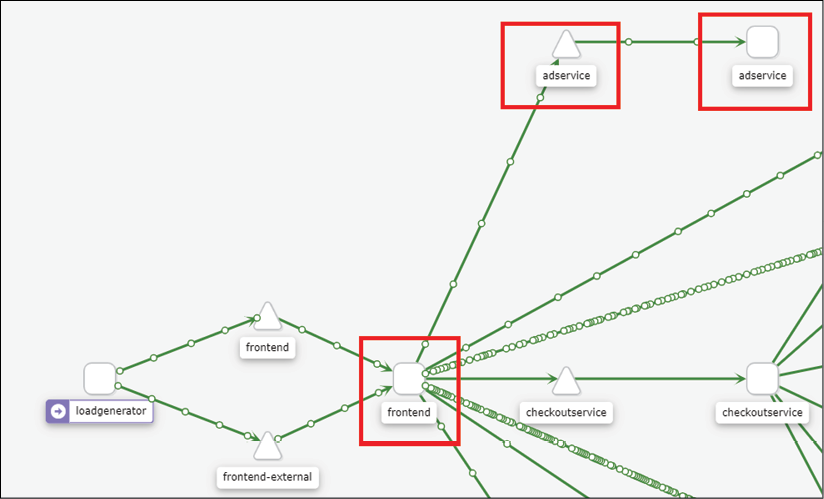 
Figure 12.11: Viewing the communication in the Graph view

The Application view will streamline what we can see, making it easier to navigate the application.

 
Figure 12.12: Simplified communication view using the Application view

As you can see, the Application view contains the components from the graph view. The communications path that involves adservice starts with the frontend pod, which targets the adservice service, which ultimately routes the traffic to the adservice pod.

We can see additional details in the application by clicking on one of the tabs at the top of the **Application** view. The first tab next to the overview is the **Traffic** tab, which provides you with a view of the traffic for the application.

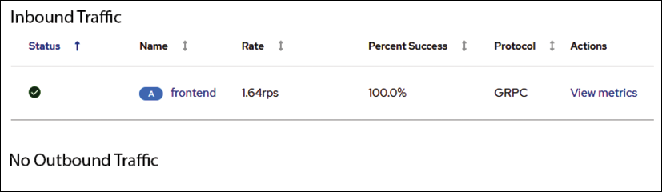 
Figure 12.13: Viewing application traffic

The Traffic tab will show inbound and outbound traffic to the application. In the adservice example from the Boutique store, we can see that that adservice has received inbound requests from the frontend. Below the inbound traffic, we can see the outbound traffic and, in our example, Kiali is telling us that there is no outbound traffic. As we can see in the overview in *Figure 12.12: Simplified communication view* using the Application view, the adservice pod does not have any object that it connects to, therefore, we would not have any traffic to view. To get additional details on the traffic, you can click on the **View Metrics** link under **Actions** – this action is the same as if you were to click the **Inbound Metrics** tab.

The **Inbound Metrics** tab will provide you with additional details about the incoming traffic. Figure 12.14: Viewing inbound metrics shows an abbreviated example for the adservice traffic.

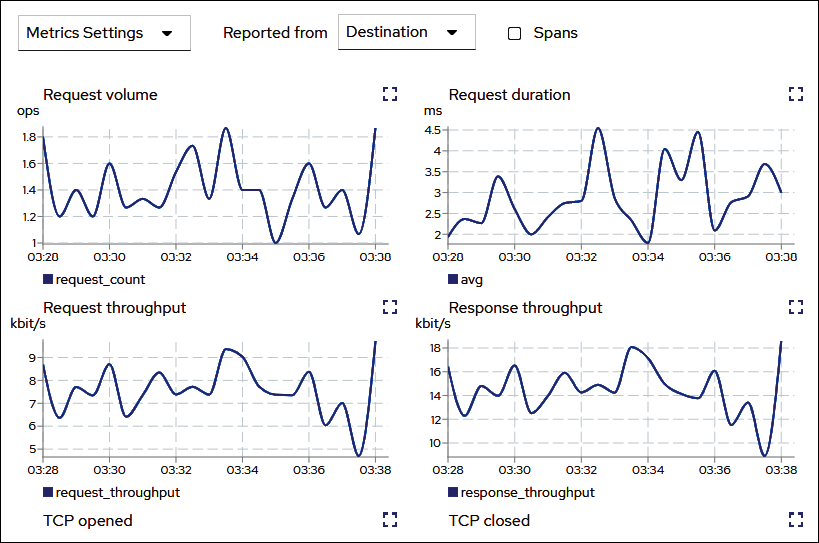 
Figure 12.14: Viewing inbound metrics

The inbound metrics will display a number of different metrics including request volume, request duration, request and response size, request and response throughput, gRPC received and sent, TCP opened and closed, and TCP received and sent. This page will update in real time, allowing you to view the metrics as they are captured.

Finally, the last tab will allow you to look at the traces for the adservice application. This is why we deployed Jaeger in our cluster when we installed Istio. Tracing is a fairly complex topic and is outside the scope of this chapter. To learn more about tracing using Jaeger, head over to the Jaeger site at https://www.jaegertracing.io/.

#### Using the Workloads view
The next view we will discuss is the **Workloads** view, which breaks down the views to the workload type, like deployments. If you click on the **Workloads** link in Kiali, you will be taken to a breakdown of the Boutique workloads.

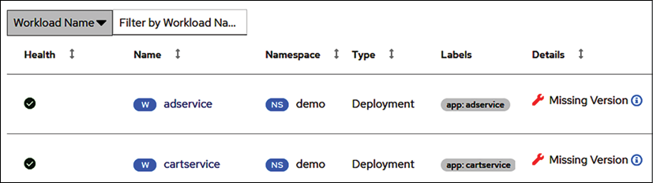 
Figure 12.15: The Workloads view

You may notice that there is a warning under the **Details** column that tells us we are missing a version of the deployments. This is one of the features of this view. It will offer details like a workload not being assigned a version, which is not an issue for standard functionality in the mesh, but it will limit the use of certain features, like routing and some telemetry. It's a best practice to always version your application, but for the example, Boutique from Google, they do not include a version in the deployments.

The **Workloads** view offers some of the same details as the **Applications** view, including traffic, inbound metrics, outbound metrics, and tracing – however, in addition to these details, we can now view the logs and details about Envoy.

If you click on the **Logs** tab, you will see the logs for the adservice container.

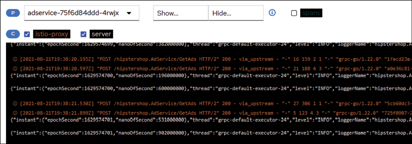 
Figure 12.16: Viewing the container logs

This is a real-time view of the logs that are being generated by the adservice container. In this view, you can create a filter to show or hide certain keywords, scroll back to previous events, change the default buffer size from 100 lines, copy the logs to your clipboard, or enter a fullscreen log view. Many users find this tab very useful since it doesn't require them to use kubectl to look at the logs; they can simply open up Kiali in a browser and quickly view the logs in the GUI.

The last tab we will discuss is the **Envoy** tab, which provides additional details about the Envoy sidecar. The details in this tab are extensive – it contains all of the mesh objects that you have included in the namespace (recall that we created a sidecar object to limit the objects to only the namespace and the ``istio-system`` namespace), all of the listeners, routes, the bootstrap configuration, config, and metrics.

By this point in the chapter, you can probably see how Istio requires its own book to cover all of the base components. All of the tabs in the Envoy tab provide a wealth of information, but it gets very detailed and we can't fit them all in this chapter, so for the purposes of this chapter, we will only discuss the **Metrics** tab.

Clicking on the **Metrics** tab, you will see metrics pertaining to the uptime of **Envoy**, the allocated memory, heap size, active upstream connections, upstream total requests, downstream active connections, and downstream HTTP requests.

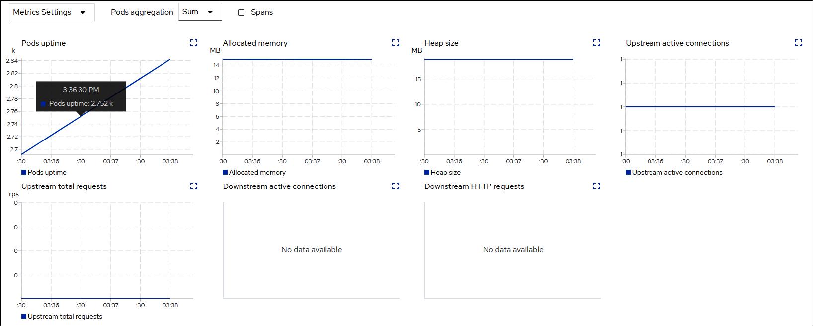 
Figure 12.17: Envoy metrics

Like most metrics, these will be beneficial if you experience issues with the Envoy proxy container. The uptime will let you know how long the pod has been running, the allocated memory tells you how much memory has been allocated to the pod, which may help to identify why an OOM condition occurred, and active connections will identify if the service has issues if the connection count is lower than expected, or at zero.

### Using the Services view
Finally, we will discuss the last view for the application, the Services view. Just as the name implies, this will provide a view of the services that are part of the workload. You can open the Services view by clicking on the **Services** option in Kiali.

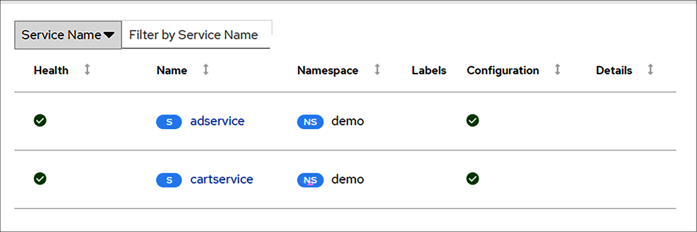 
Figure 12.18: The Services view

Similar to the other views, this will provide the names of the services and the health of each of the services. If you click on any individual service, you will be taken to the details of the service. If you were to click **adservice**, you would be taken to the overview for the service.

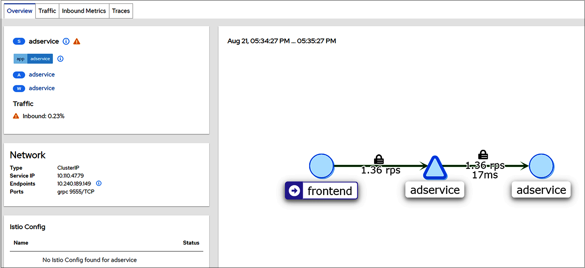 
Figure 12.19: The services overview

The **Overview** page should have some objects familiar to you. Just like the other views, it provides a view of just the objects that communicate with adservice, and it has tabs for traffic, inbound metrics, and traces – however, in addition to these, it also shows the network information for the service. In our example, the service has been configured to use a ClusterIP type, the service IP assigned is ``10.110.47.79``, it has an endpoint of ``10.240.189.149``, and it has the gRPC TCP port exposed on port 9555.

This is information you could retrieve using kubectl, but for many people, it's quicker to grab the details from the Kiali dashboard.

#### The Istio config view
The last view we have is not related to the workload in particular, instead, it's a view for the Istio config for the namespace. This view will contain the Istio objects you have created. In our example, we have three objects, the gateway, the virtual service, and the sidecar.

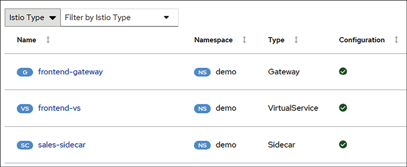 
Figure 12.20: The Istio config view

You can view the YAML for each object by clicking the name. This allows you to directly edit the object in the Kiali dashboard. Any changes that are saved will edit the object in the cluster, so be careful if you are using this method to modify the object.

This view offers one addition that the other views do not – the ability to create a new Istio object using a wizard. To create a new object, click the **Actions** dropdown in the upper right-hand corner of the Istio config view. This will bring up a list of objects that you can create, as shown in Figure 12.21: Istio object creation wizard.

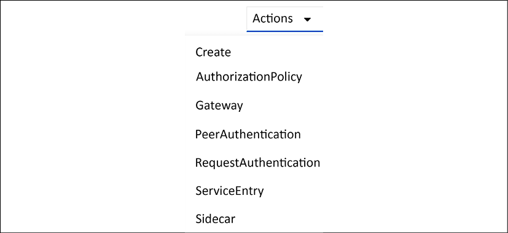 
Figure 12.21: Istio object creation wizard

As you can see in the figure, Kiali provides a wizard to create 6 Istio objects including AuthorizationPolicies, Gateways, PeerAuthentication, RequestAuthentication, ServiceEntries, and Sidecars.

Each option has a wizard to guide you through the specific requirements for that object. For example, we could create a Sidecar using the wizard as shown in *Figure 12.22: Using the Istio object wizard*.

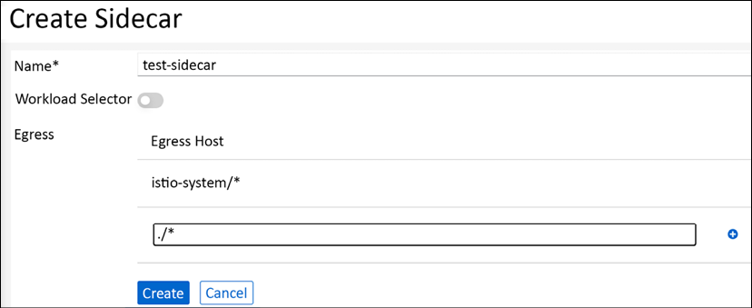 
Figure 12.22: Using the Istio object wizard

Once all fields have been entered correctly, you can click **Create** and it will create the new object in the cluster.

The wizards are a good tool for people who are new to Istio, but be careful not to rely on them too much. You should always understand how to create a manifest for all of your objects. Creating objects using wizards like these can lead to problems down the road without the knowledge of how the object works or is created.

With that last view, we have completed the Kiali section and the chapter.

# Summary
In this chapter, we introduced you to the service mesh world, using the popular open-source project Istio. In the first section of the chapter, we explained some of the advantages of using a service mesh, which included security and observability for mesh services.

The second section of the chapter detailed the installation of Istio and the different installation profiles that are available. We deployed Istio into our KinD clusters and we also removed NGNIX to free up ports ``80`` and ``443`` to be used by Istio's ingress gateway. This section also included the objects that are added to a cluster once you deploy Istio. We covered the most common objects using example manifests that reinforce how to use each object in your own deployments.

To close out the chapter, we detailed how to install Kiali, Prometheus, and Jaeger to provide powerful observability in our service mesh. We also explained how to use Kiali to look into an application in the mesh to view the application metrics and logs.

In the next chapter, we will deploy a new application and bind it to the service mesh, building on many of the concepts that were presented in this chapter.

# Questions
1. What Istio object(s) is used to route traffic between multiple versions of an application?  
a. Ingress rule  
b. VirtualService  
c. DestinationRule  
d. You can't route to multiple versions, only a single instance   
Answer: b and c

2. What tool(s) are required to provide observability in the service mesh?   
a. Prometheus  
b. Jaeger  
c. Kiali
d. Kubernetes dashboard   
Answer: a and c

3. True or false: Istio features require developers to change their code to leverage features like mutual TLS and authorization.   
a. True  
b. False  
Answer: False

4. Istio made the control plane easier to deploy and configure by merging multiple components into a single executable called:   
a. Istio  
b. IstioC  
c. istiod  
d. Pilot  
Answer: c. istiod